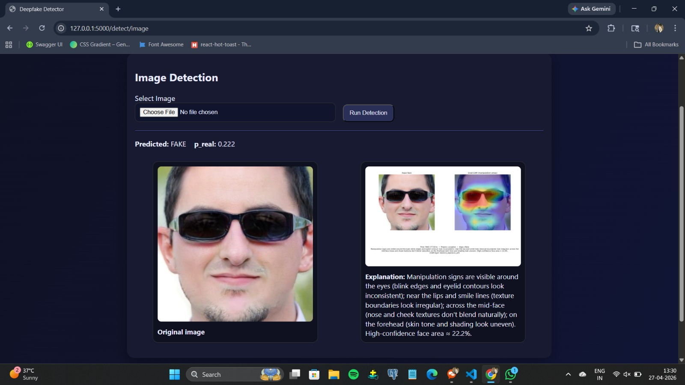
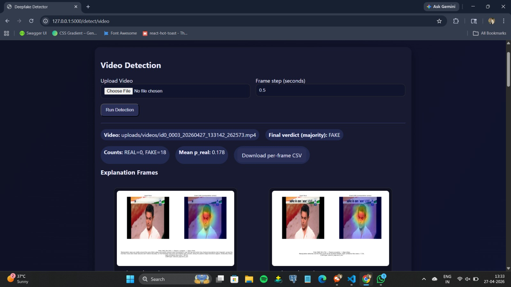
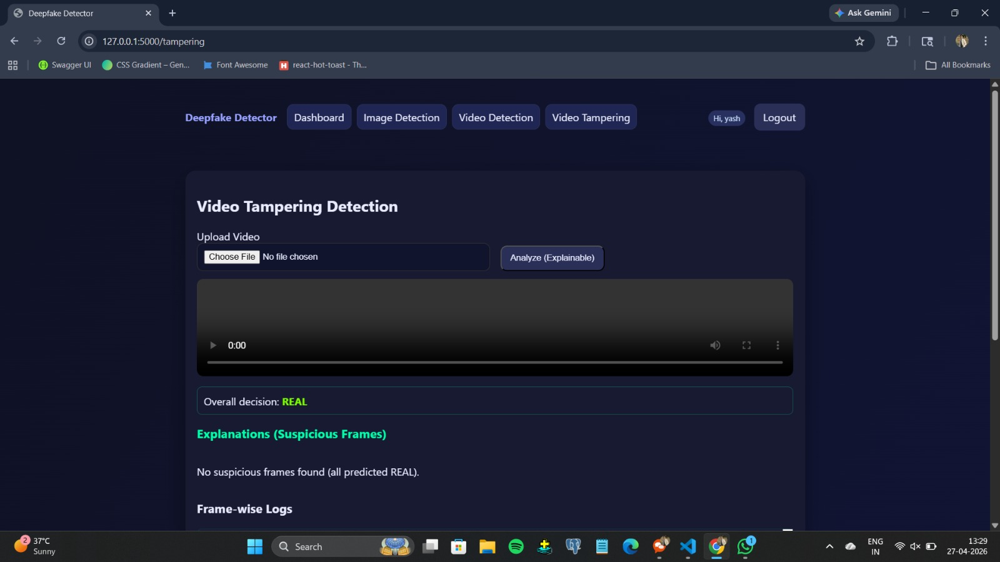

# 🕵️ Deepfake Detection System

A production-ready web application for detecting AI-generated deepfake images and videos using deep learning (CNN + Grad-CAM visualization).

---

## 🚀 Features

- 🖼️ **Image Deepfake Detection** — Upload any face image and get a real/fake prediction with confidence score
- 🎥 **Video Deepfake Analysis** — Frame-by-frame analysis of uploaded videos with timeline visualization
- 🔥 **Grad-CAM Heatmaps** — Visual explanation of what the model focuses on to make its decision
- 🔏 **Image Tampering Detection** — Detects manipulated/spliced images using a separate tampering model
- 👤 **User Authentication** — Secure login/signup system with session management
- 📊 **Analysis History** — Logged results stored per user session

---

## 🧠 Tech Stack

| Layer | Technology |
|-------|-----------|
| Backend | Python, Flask |
| Deep Learning | TensorFlow 2.18, Keras 3.8 |
| Computer Vision | OpenCV, Pillow |
| Visualization | Matplotlib, Grad-CAM |
| Database | SQLite (Flask-SQLAlchemy) |
| Frontend | HTML5, CSS3, Jinja2 Templates |

---

## 📁 Project Structure

```
deep_fake_final/
├── app.py                          # Main Flask application
├── video_analyzer.py               # Video frame extraction & analysis
├── video_deepfake_analyzer_v2.py   # Enhanced video analysis pipeline
├── run_video_detect.py             # CLI video detection script
├── testing2.py                     # Testing utilities
├── requirements.txt                # Python dependencies
├── templates/                      # Jinja2 HTML templates
│   ├── base.html
│   ├── index.html
│   ├── auth/
│   ├── detect/
│   └── tampering/
└── static/                         # Static assets (CSS, JS)
```

---

## ⚙️ Setup & Installation

### 1. Clone the repository
```bash
git clone https://github.com/yashkohakade18/Deepfake-Detection-System.git
cd Deepfake-Detection-System
```

### 2. Create a virtual environment
```bash
python -m venv venv
# Windows
venv\Scripts\activate
# macOS/Linux
source venv/bin/activate
```

### 3. Install dependencies
```bash
pip install -r requirements.txt
```

### 4. Download Model Weights

> ⚠️ **Model files are not included in this repo** due to GitHub's file size limits.

Download the pre-trained model files and place them as follows:

| File | Destination |
|------|------------|
| `new_deepfake_detector.h5` | Project root `/` |
| `tampering_detector_final.pth` | `static/models/` |

*(Contact the author or use the links below if models are hosted externally)*

### 5. Run the application
```bash
python app.py
```

Open your browser at `http://127.0.0.1:5000`

---
## Sample UI








## 🖥️ Usage

1. **Register / Login** — Create an account or log in
2. **Image Detection** — Navigate to *Detect → Image*, upload a face image, view prediction + Grad-CAM heatmap
3. **Video Detection** — Navigate to *Detect → Video*, upload a video, view per-frame analysis
4. **Tampering Detection** — Navigate to *Tampering*, upload an image to check for splicing/manipulation

---

## 📊 Model Details

- **Deepfake Detector**: Custom CNN trained on FaceForensics++ dataset
- **Input**: 224×224 RGB face crops
- **Output**: Binary classification (Real / Fake) + confidence score
- **Explainability**: Grad-CAM applied to final convolutional layer

---

## 📋 Requirements

```
flask>=3.0.0
werkzeug>=3.0.0
tensorflow==2.18.0
keras==3.8.0
opencv-python-headless>=4.9.0.80
protobuf<5
Pillow>=10.0.0
matplotlib>=3.8.0
numpy>=1.26.4
```

---

## 🙋 Author

**Yash Kohakade**  
GitHub: [@yashkohakade18](https://github.com/yashkohakade18)

---

## 📄 License

This project is licensed under the MIT License.
